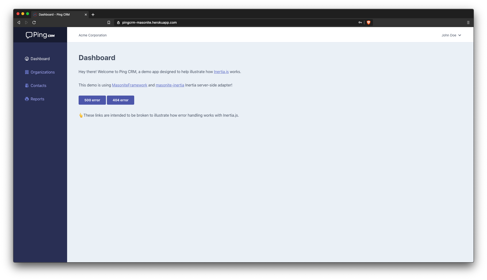

# Ping CRM [Work In Progress !]

A demo application to illustrate how Inertia.js works with:

- Server-side adapter: [masonite-inertia](https://github.com/girardinsamuel/masonite-inertia.git) for [MasoniteFramework](https://github.com/MasoniteFramework/masonite)
- Client-side adapter: [inertia.js]() for [Vue.js](https://github.com/vuejs/vue)

🎉 [https://pingcrm-masonite.herokuapp.com/](https://pingcrm-masonite.herokuapp.com/)

> 

Disclaimer :

- the demo is based on the [official Inertia.js demo](https://github.com/inertiajs/pingcrm.git) (for the Vue part)
- there are still bugs because it's a WIP

This demo is using [masonite-js-routes](https://github.com/girardinsamuel/masonite-js-routes) to publish routes client-side and `ziggy-js` which provides a very handy `route()` helper in Javascript !

## Installation

Clone the repo locally:

```sh
https://github.com/girardinsamuel/pingcrm-masonite.git pingcrm
cd pingcrm
```

Install Python dependencies:

```sh
pip install -r requirements.txt
```

Install NPM dependencies:

```sh
npm ci
```

Build assets:

```sh
npm run dev
```

Setup configuration:

```sh
cp .env.example .env
```

Generate application key and add it to `APP_KEY` in `.env` file:

```sh
python craft key
```

Create an SQLite database. You can also use another database (MySQL, Postgres), simply update your configuration accordingly.

```sh
touch database/database.sqlite
```

Run database migrations:

```sh
python craft migrate
```

Run database seeder:

```sh
python craft seed:run
```

Run the dev server (the output will give the address):

```sh
python craft serve
```

You're ready to go! Visit Ping CRM in your browser, and login with:

- **Username:** johndoe@example.com
- **Password:** secret

## Running tests

There is no tests yet for this demo of Ping CRM.

## Deploying in production (Heroku)

```
npm run prod
git checkout production
git merge master
# main or master only can be deployed to prod in Heroku
git push heroku production:master
```

```
heroku run craft migrate
```

```
heroku run craft seed:run
```
